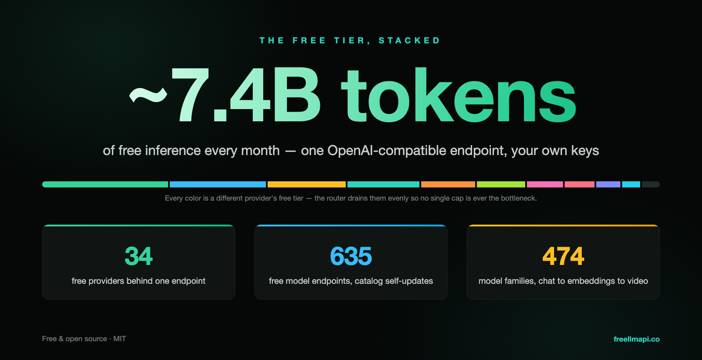
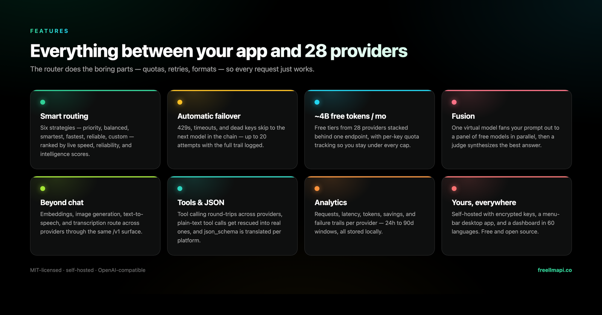
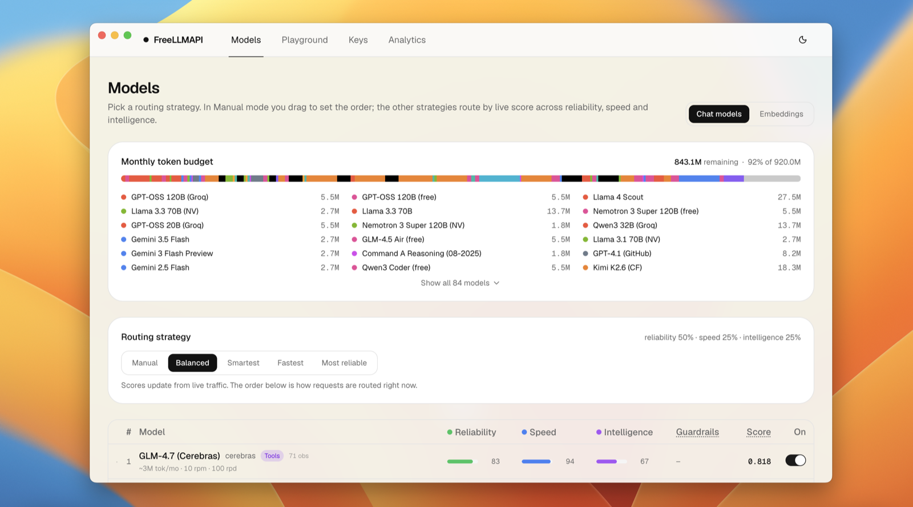
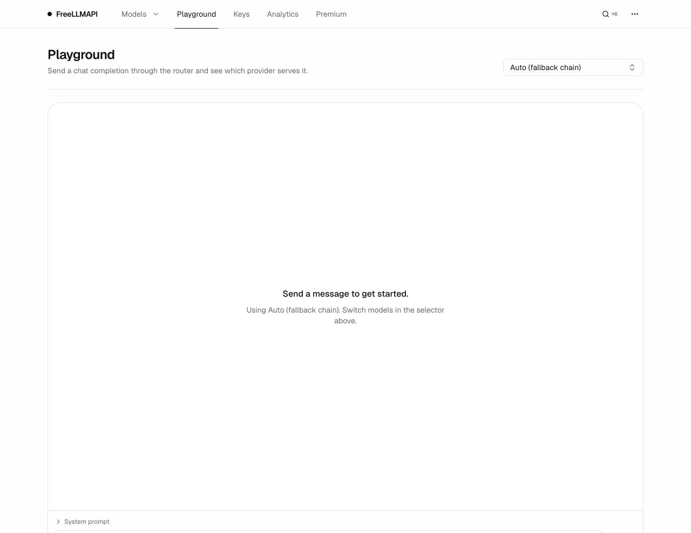

<div align="center">

# FreeLLMAPI

**每月 74 亿词元。34 家免费 LLM 提供方。635 个免费模型端点。一个 OpenAI 兼容端点。**

把几十家提供方的免费额度，连同任意自建的 OpenAI 兼容聊天、嵌入、图像和音频端点，一起聚合到单个 `/v1` API 之后。密钥加密存储。路由器为每个请求挑选当前可用的最佳模型，某家提供方触发限流时自动转移到下一家，并按密钥跟踪用量，让你始终待在各家的免费额度之内。

[](https://github.com/PryxIntel/free-llm-api/actions/workflows/ci.yml)
[](https://github.com/PryxIntel/free-llm-api/stargazers)
[](LICENSE)
[](#参与贡献)
[](https://github.com/PryxIntel/free-llm-api/pkgs/container/free-llm-api)

[English](README.md) · **简体中文**

本翻译可能滞后，最新内容以英文 README 为准。


你的路由器支持多模型智能调度与负载均衡：新的免费模型、额度变更和兼容性修复，都经过统一验证与管理。

</div>

---

## 目录

- [为什么会有这个项目](#为什么会有这个项目)
- [支持的提供方](#支持的提供方)
- [兼容的 CLI 与编程智能体](#兼容的-cli-与编程智能体)
- [横向对比](#横向对比)
- [功能](#功能)
- [快速开始](#快速开始)
- [桌面应用](#桌面应用)
- [兼容 OpenAI 的客户端](#兼容-openai-的客户端)
- [语言](#语言)
- [Premium 实时目录](#premium-实时目录)
- [使用 API](#使用-api)
- [截图](#截图)
- [工作原理](#工作原理)
- [局限性](#局限性)
- [参与贡献](#参与贡献)
- [免责声明](#免责声明)

**指南：** [安装与部署](docs/zh-cn/install/01-install.md) · [API 参考](docs/zh-cn/api/01-rest-api.md) · [客户端与编程智能体](docs/zh-cn/clients/01-agent-clients.md) · [提示词压缩](docs/zh-cn/compression/01-compression-pipeline.md) · [架构与内部实现](docs/zh-cn/architecture/00-high-level-index.md) · [文档索引](docs/zh-cn/README.md) · [贡献者指南](CONTRIBUTING.md)

> 所有指南都已有中文版，上面的链接指向中文页面；少数页面在英文原文更新后尚未同步，以英文版为准，每页页首都可切换到英文原文。完整的翻译状态见 [这里](docs/zh-cn/OVERVIEW.md#翻译状态)。

## 为什么会有这个项目

如今每家正经的 AI 实验室都提供免费额度：每月几百万词元，每天几千次请求。单独看，每一份都只是个玩具。叠加起来，它们合计约 **每月 74 亿词元** 的可用推理能力，覆盖 **474 个模型系列 / 635 个提供方端点**，从小而快的到相当能打的都有。

问题在于手工叠加太痛苦：三十四套不同的 SDK，三十四种不同的限流规则，三十四个请求可能失败的地方。FreeLLMAPI 把这些收拢成一个 OpenAI 兼容端点。把任意 OpenAI 客户端库指向你的本地服务，它就会在你添加过密钥的提供方之间透明路由。

而且免费额度的格局每周都在变：提供方会上线新模型、下线旧模型，并且不打招呼就调整额度。这些 FreeLLMAPI 都替你盯着。路由器会自动同步经过签名的模型目录，所以你的部署不用 `git pull` 也能跟上。跟进速度见 [Premium (Coming Soon)](#premium-即将推出)。



## 支持的提供方

<div align="center">
<table>
<tr>
<td align="center" width="150"><br/><b>Google</b></td>
<td align="center" width="150"><picture><source media="(prefers-color-scheme: dark)" srcset="repo-assets/providers/groq-dark.png"></picture><br/><b>Groq</b></td>
<td align="center" width="150"><br/><b>Cerebras</b></td>
<td align="center" width="150"><picture><source media="(prefers-color-scheme: dark)" srcset="repo-assets/providers/opencode-dark.png"></picture><br/><b>OpenCode Zen</b></td>
</tr>
<tr>
<td align="center"><br/><b>Mistral</b></td>
<td align="center"><br/><b>OpenRouter</b></td>
<td align="center"><br/><b>Cloudflare</b></td>
<td align="center"><br/><b>Cohere</b></td>
</tr>
<tr>
<td align="center"><br/><b>Z.ai（智谱）</b></td>
<td align="center"><br/><b>NVIDIA</b></td>
<td align="center"><br/><b>HuggingFace</b></td>
</tr>
<tr>
<td align="center"><a href="https://modelscope.cn"><b>ModelScope 魔搭</b><br/>Qwen3 · DeepSeek V4 · GLM-5（需要绑定阿里云中国站账号）</a></td>
</tr>
</table>

<i>…… 以及另外 22 家免费提供方</i>

</div>

此外还有 **自定义** 提供方：在密钥页上，把聊天、嵌入、图像或音频模型指向任意 OpenAI 兼容端点（llama.cpp、LM Studio、vLLM、本地 Ollama，或者一个远程网关）。

完整且始终最新的列表可在控制面板中查看，含每个模型的限流规则、上下文窗口和免费词元额度。

## 兼容的 CLI 与编程智能体

<div align="center">
<table>
<tr>
<td align="center" width="150"><br/><b>Claude Code</b></td>
<td align="center" width="150"><br/><b>Codex CLI</b></td>
<td align="center" width="150"><br/><b>Gemini CLI</b></td>
<td align="center" width="150"><br/><b>Aider</b></td>
</tr>
<tr>
<td align="center"><br/><b>Cline</b></td>
<td align="center"><br/><b>Roo Code</b></td>
<td align="center"><br/><b>Continue</b></td>
<td align="center"><br/><b>OpenCode</b></td>
</tr>
<tr>
<td align="center"><br/><b>Goose</b></td>
<td align="center"><br/><b>Qwen Code</b></td>
<td align="center"><br/><b>Kilo Code</b></td>
<td align="center"><br/><b>Crush</b></td>
</tr>
<tr>
<td align="center"><br/><b>Cursor</b></td>
<td align="center"><br/><b>Zed</b></td>
<td align="center"><br/><b>JetBrains AI</b></td>
</tr>
</table>

<i>…… 以及任何兼容 OpenAI 的客户端、Anthropic SDK、Gemini SDK，或支持 Ollama 的应用</i>

</div>

其中大多数一条命令就能配好：`npx freellmapi setup-claude`、`setup-codex`、`setup-aider`，还有另外十几个生成器。它们会拉取你当前的实时目录，备份已有配置，并且绝不覆盖你已经写好的内容。Claude Code 和 Codex 另有零留存启动器（`freellmapi launch`、`freellmapi launch-codex`），只把凭据注入子进程。Zed 和 JetBrains AI 通过可选的 [Ollama 模拟](docs/en/clients/01-agent-clients.md#ollama-clients) 接入；Gemini CLI 走它自己的 `/v1beta` 协议。

各工具的具体配方、setup CLI 参考、给无法发送请求头的客户端用的可撤销 URL 令牌，以及 MCP 服务，都在 **[客户端与编程智能体 →](docs/zh-cn/clients/01-agent-clients.md)**

## 横向对比


基于 2026 年 7 月的公开文档整理，欢迎指正。

## 功能



- **OpenAI 的全部接口** —— `/v1/chat/completions`、`/v1/responses`（Codex CLI 需要它）、`/v1/completions`（编辑器的幽灵文本补全）、`/v1/images/generations`、`/v1/audio/speech`、`/v1/embeddings` 和 `/v1/models`，流式与非流式均可，来自官方 SDK 或任何 OpenAI 兼容客户端都行。[API 参考 →](docs/zh-cn/api/01-rest-api.md)
- **Anthropic Messages API** —— `/v1/messages` 在同一套路由之上讲 Anthropic 的协议，所以 **Claude Code** 和官方 Anthropic SDK 可以直接跑在你的免费池上。[详情 →](docs/zh-cn/api/01-rest-api.md#anthropic-与-claude-客户端)
- **原生 Gemini 与 Ollama 接口** —— Gemini CLI 可以用 `/v1beta`（`generateContent`、流式、词元计数、模型列表）；可选的 Ollama 模拟则为 Zed、JetBrains 以及其他本地模型客户端提供 NDJSON 的 chat/generate、标签、元数据和嵌入。
- **Fusion（多模型合成）** —— 请求虚拟模型 `fusion`，路由器会把你的提示词并行分发给一组风格各异的免费模型，再由一个评审模型从这些草稿中合成出一个答案。[详情 →](docs/zh-cn/api/01-rest-api.md#fusion-多模型合成)
- **图像生成与文本转语音** —— `/v1/images/generations` 和 `/v1/audio/speech` 会在提供媒体模型的提供方之间路由，也包括自定义的 OpenAI 兼容媒体端点。
- **工具调用与结构化输出** —— OpenAI 风格的 `tools` 可在各提供方之间往返（纯文本形式的工具调用会被救回成真正的 `tool_calls`），另有 `response_format`、`seed`、`logprobs`、惩罚项以及其余采样参数按提供方透传。
- **智能路由，六种策略** —— 实时的每模型速度、能力、稳定性评分决定你的链路顺序；遇到 429/5xx 时自动转移到下一个模型，并带冷却和密钥轮换。[路由详解 →](docs/zh-cn/architecture/00-high-level-index.md#工作原理)
- **统一模型与配置档** —— 同一个模型在多家提供方上会合并成一个条目，并在组内严格故障转移；命名的回退链配置档（比如一条编程链、一条视觉链）可以在仪表盘里切换，也可以按请求用 `auto:<profile>` 指定。
- **按密钥的限流跟踪** —— 以 `(平台, 模型, 密钥)` 为单位的 RPM/RPD/TPM/TPD 计数器，会学习提供方公布的上限，让路由始终不越线。
- **自更新的模型目录** —— 路由器定期同步经过签名的目录：新模型、额度变更和提供方的怪癖修复都会自动生效。[Premium →](#premium-即将推出)
- **粘性会话与上下文交接** —— 对话会在同一个模型上停留 30 分钟；如果中途确实换了模型，可选的精简交接说明能让话题保持连贯。[详情 →](docs/en/clients/01-agent-clients.md#context-handoff)
- **提示词压缩（可选开启）** —— 一条共享且失败即放行的请求流程，可以在缓存查找和路由之前对提示词去重、过滤工具输出、压紧重复的 JSON，并裁掉过时的上下文。[详情 →](docs/zh-cn/compression/01-compression-pipeline.md)
- **密钥加密存储，对外只有一个令牌** —— 提供方密钥以 AES-256-GCM 加密存放在 SQLite 中，每次请求时在内存里解密；你的应用自始至终只看到一个统一的 `freellmapi-…` bearer 令牌。
- **管理仪表盘与分析** —— React 界面用来管理密钥、调整链路顺序、使用试验台，并查看 24 小时到 90 天窗口的 p50/p95/首个词元用时分析；带登录保护，支持明暗主题和 [60 种语言](#语言)。
- **MCP 服务与交互式文档** —— 智能体可以通过 `/mcp` 查询可用模型、提供方健康状况和路由策略；`/v1/docs` 提供一个零依赖的 OpenAPI 浏览器。[编程智能体 →](docs/zh-cn/clients/01-agent-clients.md)
- **运维上的便利** —— 可选的响应缓存、加密的数据库备份、定期密钥健康检查、密钥批量导入导出、声明式启动配置。[安装与部署 →](docs/zh-cn/install/01-install.md)
- **能跑 Node 20+ 的地方都能跑** —— Windows、macOS、Linux 服务器，或者一块小小的 ARM 单板机（树莓派也行）。在 PM2 / systemd 或你惯用的守护进程下，空闲时常驻内存约 40 MB。

项目范围是刻意收窄的，参见 [尚不支持的部分](docs/zh-cn/architecture/00-high-level-index.md#尚不支持)。

## 快速开始

**推荐方式**（克隆并启动本地环境）：

```bash
git clone https://github.com/PryxIntel/free-llm-api.git
cd free-llm-api
npm install
npm run dev
```

打开 http://localhost:5173 （管理面板）与 http://localhost:3001 （网关端点），在 **密钥** 页添加你的提供方密钥，按喜好调整 **回退链** 的顺序，然后在 **密钥** 页顶部拿到你的统一 API 密钥。这个统一密钥就是你的 OpenAI SDK 要指向的东西。

在 Windows 上，最省事的方式是桌面版 **[Releases 里的安装包](https://github.com/PryxIntel/free-llm-api/releases/latest)**。Android 上可参考实验性的 [Termux 指南](docs/zh-cn/install/02-android-termux.md)。

其余内容，包括 Docker Compose、本地开发、声明式启动配置、生产构建、局域网访问和备份，都在 **[docs/zh-cn/install/01-install.md](docs/zh-cn/install/01-install.md)**。

## 桌面应用

[`desktop/`](desktop) 里有一个原生的菜单栏应用：整个路由器加仪表盘就在你的托盘里本地运行，还有一个玻璃质感的悬浮窗显示实时请求统计。



**[从 Releases 下载](https://github.com/PryxIntel/free-llm-api/releases/latest)** —— 每个版本都附带 macOS 的 `.dmg` 和 Windows 的 `.exe` 安装包。不需要注册账号或设置密码：你唯一需要的凭据就是托盘悬浮窗里的统一 API 密钥。从源码构建的步骤，以及数据存放位置，见 [docs/zh-cn/install/01-install.md#桌面应用](docs/zh-cn/install/01-install.md#桌面应用)。

macOS 要求 12 Monterey 或更高版本；Apple Silicon 请选择 **arm64**，Intel 请选择 **x64**。两种 Mac 构建都提供 ZIP 下载。

## 兼容 OpenAI 的客户端

任何能指定 OpenAI 兼容 base URL 的东西都能用：把它设成 `http://localhost:3001/v1`，配上仪表盘里的统一密钥。**Claude Code**、**Codex CLI**、**Cline / Roo Code**、**Continue**（含行内补全）、**Aider**、**opencode** 和 **Cursor** 在 **[docs/zh-cn/clients/01-agent-clients.md](docs/zh-cn/clients/01-agent-clients.md)** 里各有一段简短配方。此外路由器本身还兼作 MCP 服务，你的智能体可以在会话中随时查询它。

最快的配置方式是根据你服务器上实际可用的模型生成：

```bash
npx freellmapi setup-claude --url http://localhost:3001 --api-key <统一密钥>
```

每个生成器都支持 `--dry-run`，改动已有文件前会先创建带时间戳的备份，并且是合并进用户配置而不是覆盖。启动器则把凭据完全挡在配置文件之外：Claude Code 用 `npx freellmapi launch`，Codex 用 `npx freellmapi launch-codex`。

| 智能体 | 自动配置命令 | Base URL |
| --- | --- | --- |
| Claude Code | `setup-claude` | 根路径 |
| Codex CLI | `setup-codex` | `/v1` |
| Cline | `setup-cline` | `/v1` |
| Continue | `setup-continue` | `/v1` |
| Aider | `setup-aider` | `/v1` |
| OpenCode | `setup-opencode` | `/v1` |
| Goose | `setup-goose` | `/v1` |
| Qwen Code | `setup-qwen` | `/v1`（或原生 `/v1beta`） |
| Roo / Kilo / Crush | `setup-roo` / `setup-kilo` / `setup-crush` | `/v1` |
| Cursor | `setup-cursor` 指南 | 公网可达的 `/v1` URL |

FreeLLMAPI 在设计上是本地优先、单用户的。你的提供方密钥留在你自己的 SQLite 数据库里加密存放，请求从你的机器直接发往你启用的上游提供方。

## 语言

仪表盘提供 **60 种语言**（桌面托盘菜单为 6 种）。界面在首次加载时会自动检测你的浏览器或系统语言，之后随时可以在 **⋯ → 设置** 里切换，选择会被记住。从右往左书写的语言（العربية、עברי特、فارسی、اردو）会自动翻转整个布局，并且只有当前语言的词典会被加载，其余的完全不占用你的带宽。

完整的语言列表在 [`client/src/i18n/locale-config.ts`](client/src/i18n/locale-config.ts)。

中文的术语约定见 [docs/TRANSLATION.md](docs/TRANSLATION.md)，提交翻译前请先过一遍，这样 README 和仪表盘里的说法能对得上。

## PryxIntel Premium（即将推出）

PryxIntel Premium 正在积极开发中，将为团队与高并发场景带来更强大的云端编排功能：
- **实时零日目录同步**：提供方上线新模型或调整免费额度时毫秒级推送。
- **全球多地域智能路由**：自动按延迟与地理分布进行跨云多活调度。
- **企业级团队配额管理**：细粒度 Token 预算池与 Agent 级别限流保护。
- **深度链路追踪与智能预测**：基于模型健康度自动规避拥塞节点。

核心路由器与本地模型均衡调度功能将永远保持开源、完全免费。欢迎关注 [PryxIntel GitHub 仓库](https://github.com/PryxIntel/free-llm-api) 获取最新进展。

## 使用 API

```python
from openai import OpenAI

client = OpenAI(
    base_url="http://localhost:3001/v1",
    api_key="freellmapi-your-unified-key",
)

resp = client.chat.completions.create(
    model="auto",  # 交给路由器挑选；也可以用 "auto:fast"、"auto:smart"、某个配置档，或具体的模型 id
    messages=[{"role": "user", "content": "用一句话概括罗马的衰亡。"}],
)
print(resp.choices[0].message.content)
print("Routed via:", resp.headers.get("x-routed-via"))
```

流式、`auto:*` 路由策略、工具调用、视觉输入、Gemini 的 Google 搜索接地、嵌入，以及 Anthropic Messages 接口，连同各自的 curl 和 Python 示例，全都在 **[docs/zh-cn/api/01-rest-api.md](docs/zh-cn/api/01-rest-api.md)**。每个响应都带一个 `X-Routed-Via: <平台>/<模型>` 头，你可以据此看出实际是哪家提供方处理的。

## 截图

### 模型

选一种路由策略，看着每月词元额度在整个提供方队列上被填满。每个模型都显示实时的稳定性、速度和智能评分，下面的顺序就是当前请求的路由顺序。


### 密钥

管理提供方凭据，并拿到你的应用要用的统一 API 密钥。每个密钥都有一个状态点，以及最近一次健康检查的时间。


### 试验台

通过路由器发一条聊天补全请求，看看是哪家提供方处理的，模型 ID 和延迟就印在消息上。可以用按钮、拖放或粘贴来添加附件：图片（PNG/JPEG/WebP/GIF）会在浏览器里先缩小，再作为图像内容块发给具备视觉能力的模型；文本文件（TXT/MD/CSV/JSON/LOG）则以代码块的形式内联进提示词。



### 分析

请求量、成功率、输入与输出词元、平均延迟，以及按提供方的细分，覆盖 24 小时 / 7 天 / 30 天 / 90 天窗口。


## 工作原理


一个请求进去，最合适的免费模型出来：路由器挑出优先级最高、密钥健康且未超出任何限流的模型，在内存中解密密钥并调用提供方；遇到 429/5xx 就让那个密钥进入冷却，然后重试你链路上的下一个模型。组件走查、路由内部实现和运维细节都在 **[docs/zh-cn/architecture/00-high-level-index.md](docs/zh-cn/architecture/00-high-level-index.md)**。

## 局限性

叠加免费额度是有实实在在的代价的：没有前沿模型，延迟不稳定，没有 SLA。而且到了一天的后半段，顶级模型陆续触及当日上限，这个端点的实际智能水平会下滑，然后在 UTC 午夜重置。在拿它做任何正经东西之前，请先读一遍 **[docs/zh-cn/architecture/00-high-level-index.md#局限性](docs/zh-cn/architecture/00-high-level-index.md#局限性)** 里那份诚实的清单。

## 参与贡献

非常欢迎贡献者！开发流程、PR 要求，以及关于 AI/LLM 辅助贡献的政策（简版：欢迎，质量标准和其他 PR 一样），都在 [CONTRIBUTING.md](CONTRIBUTING.md)。适合上手的第一个 PR：

- **加一家提供方** —— 复制 `server/src/providers/openai-compat.ts` 作为模板，在 `server/src/providers/index.ts` 里接上，在 `server/src/db/index.ts` 里种下它的模型，并在 `server/src/__tests__/providers/` 加一个测试。
- **加一个接口** —— moderations 以及其他 OpenAI 兼容接口。提供方基类可以扩展新方法，各适配器声明自己支持哪些。
- **改进路由** —— 成本感知路由（在最便宜、最健康、最快之间取舍）、更好的延迟加权优先级、区域固定。
- **打磨仪表盘** —— 分析页的图表、密钥轮换的交互、从 `.env` 批量导入密钥。
- **文档** —— 更多示例、Go/Rust 等语言的客户端片段、Docker 或 Fly 的部署配方。

`npm install && npm run dev` 就能起来：服务在 :3001，仪表盘在 :5173，两边都有热更新。PR 应当包含测试、保持现有测试套件通过（`npm test`），并遵循仓库里已有的 `.editorconfig` 和 tsconfig 默认配置。数据库迁移流程和完整的贡献者循环见 [CONTRIBUTING.md](CONTRIBUTING.md)。

### 贡献者

约 90 位贡献者的头像墙维护在[英文 README](README.md#contributors) 里。它几乎每次合并都会变动，所以只保留一份，不在各语言版本中重复。

## 免责声明

**本项目用于个人实验和学习，不适用于生产环境。** 免费额度的存在是为了让开发者拿来做原型；它们不是稳定、有支持的推理基础设施，也不该被当成这种东西。如果你要在 FreeLLMAPI 之上做真正的产品，上线前请换成付费 API。你和每家上游提供方之间的关系，受你注册账号时接受的条款约束；流量经由本项目代理时这些条款依然适用，遵守它们是你的责任。

各家提供方的服务条款如何看待一个个人的、单用户的代理，在 2026 年 5 月逐家审查过，结论在 [docs/zh-cn/architecture/00-high-level-index.md#服务条款审查](docs/zh-cn/architecture/00-high-level-index.md#服务条款审查)。

## 许可证

[MIT](LICENSE)

---

<sub>本页中文翻译由社区贡献并由 PryxIntel 维护。</sub>
